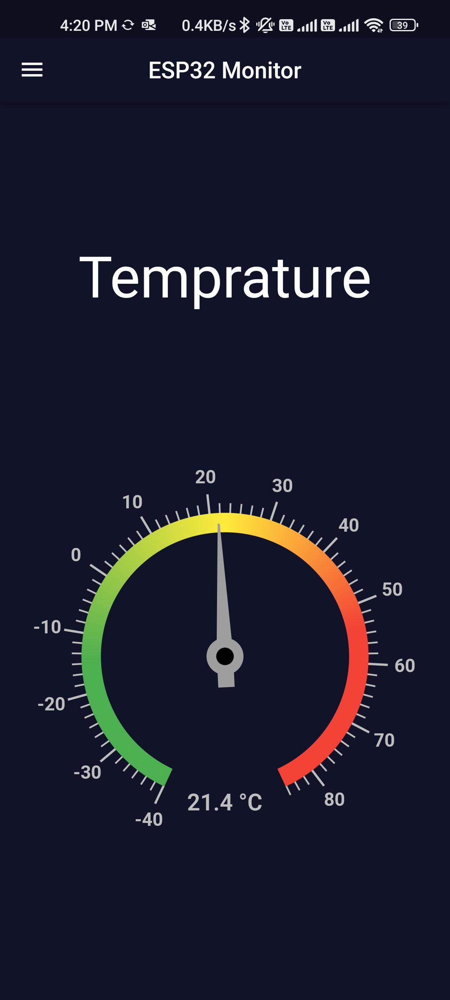

  
  <h1>ESP Monitor</h1>
  
ESP Monitor - Your Best Weather Monitoring Application 

  

## Table of Contents

- [Introduction 🏛️](#introduction-🏛️)
- [Demo 🚀](#demo-🚀)
- [Features 🌟](#features-🌟)
- [Screenshots 📸](#screenshots-📸)
- [Packages Used 📚](#packages-used-📚)
- [Author](#team-section)

  

## Introduction 🏛️

Welcome to our innovative Flutter application designed to provide real-time monitoring of temperature, pressure, altitude, and humidity—an essential utility derived from our IoT project powered by ESP32 technology. This cutting-edge app seamlessly connects to an ESP32 device, ensuring accurate and up-to-the-minute data retrieval.

With Firebase serving as the robust backend for our application, you can trust that your data is not only securely stored but also readily accessible for analysis and historical tracking. Our app is engineered to empower users with a comprehensive understanding of environmental conditions, making it an ideal solution for various scenarios, from home environments to industrial settings.

  

## Demo 🚀

https://github.com/Mina329/Weather-Station-ESP32-Project-Flutter/assets/96777964/481757b6-1756-4cff-81f7-b4ff7523cd53

  

## Features 🌟

- 6+ Screens
- Real-time Monitoring
- ESP32 Integration
- Firebase Backend
- Alarm System
- User-Friendly Interface

  

## Screenshots 📸

<table>
  <tbody>
    <tr>
      <td align="center"></td>
      <td align="center"></td>
      <td align="center"></td>
    </tr>
    <tr>
      <td align="center"></td>
      <td align="center"></td>
    </tr>
  </tbody>
</table>

  

## Packages Used 📚

The app utilizes several packages to enhance its functionality. Some of the key packages used include:

- weather_icons
- syncfusion_flutter_gauges
- syncfusion_flutter_charts
- firebase_core
- firebase_database
- bloc
- flutter_bloc
- flex_color_scheme
- font_awesome_flutter
- email_validator
- avatar_glow
- toggle_switch
- freezed_annotation
- json_annotation
- csv
- permission_handler
- path_provider
- workmanager
- cloud_firestore
- logger
- file_picker
- path

These packages are crucial for enabling various functionalities and enhancing the app's capabilities.

  

